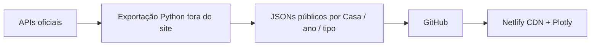

# Armazenamento e publicação — decisão atual

Decisão em 9/10/2026: **JSONs estáticos versionados no Git**, preparados para o futuro website no Netlify. A exportação inicial contém 27.097 projetos PL/PLP/PEC apresentados entre 2023 e 9/10/2026 e 594 parlamentares em exercício; os 33 arquivos ocupam cerca de 16 MB. O [manifesto](../public/dados/v1/manifesto.json) traz totais, hashes e período. O [relatório de validação](validacao/resumo.md) libera a composição atual e a exploração de projetos; presença, participação em votações, aprovação final, ideologia e direção de medida continuam pendentes ou bloqueadas.

## Recomendação para o primeiro lançamento

O navegador lê somente arquivos em [`public/dados/v1/`](../public/dados/v1/), escolhe Casa/ano/tipo e desenha séries já agregadas. Ele não consulta as APIs oficiais, extrai PDFs, limpa dados ou executa joins volumosos. O exportador [`export_static_data.py`](../scripts/export_static_data.py) faz a coleta e validação. O workflow do GitHub foi deixado **manual** (`workflow_dispatch`); não há agendamento automático nem reprocessamento pelo site.

## O que armazenar em cada camada

| Camada | Conteúdo | Formato e local sugeridos | Regra de publicação |
| --- | --- | --- | --- |
| Bronze | Respostas e arquivos originais com URL, parâmetros, horário e hash. | Reservado em `data/bronze/`, ignorado pelo Git; persistência durável será decidida antes de coleta bruta ampla. | Não é exposto ao site. A exportação atual não arquiva todas as respostas brutas. |
| Silver | Normalização, relações e tabelas intermediárias. | Reservado em `data/silver/`, ignorado pelo Git. | A exportação atual faz apenas a normalização mínima dos campos das listagens em memória. |
| Gold | Projetos, composição atual, agregados e cobertura pronta para leitura. | JSONs em `public/dados/v1/`, versionados no Git. | Apenas indicadores aprovados no relatório de validação; o manifesto diferencia campos não coletados de valores zero. |

O esquema público v1 separa `ano_identificacao` de `data_apresentacao`, usa IDs como texto dentro de cada Casa e publica projetos por **ano de apresentação**. Os arquivos `parlamentares/*/atuais.json` representam somente o retrato da coleta. Temas em escala completa, autoria detalhada da Câmara, tramitações, votações, PDFs e rótulos enriquecidos ainda não foram exportados; estão listados em `cobertura.json`.

Os notebooks mostraram por que essas separações importam: 3 de 10 PL consultados com `ano=2026` tinham apresentação em outro ano, e a API da Câmara recusou uma janela anual de datas (HTTP 400), aceitando uma trimestral. O pipeline deve particionar por **data de apresentação** e conferir o ano do resultado antes de agregar. Uma amostra de evento teve 16 IDs iguais na API e no arquivo, mas isso não define elegibilidade; uma votação teve 429 votos iguais nas duas fontes, mas isso não define a taxa de participação. [Evidências completas](validacao/resumo.md).

## Fluxo de atualização sem reprocessar no website

1. Executar `python scripts/export_static_data.py` localmente ou pelo workflow manual. O script consulta janelas trimestrais, pagina a Câmara, limita o ritmo e repete 429/503. Uma falha interrompe a exportação antes da substituição dos JSONs.
2. Validar Casa/tipo/data, IDs únicos e somas dos agregados. O manifesto lista hash SHA-256 e tamanho de cada arquivo. Correções retroativas são absorvidas por uma nova exportação completa; a execução inicial precisou de 313 chamadas e gerou cerca de 16 MB.
3. Publicar a atualização como um commit único. O futuro deploy do Netlify entrega esse snapshot pelo CDN. Cada visual mostra `gerado_em_utc` e período. Não existe atualização do banco nem ETL em tempo de requisição.

O `.gitignore` exclui Bronze/Silver, PDFs, credenciais e artefatos locais. Não há chave de API necessária para a exportação pública atual. O workflow manual faz commit somente de `public/dados/v1/`.

## Alternativas gratuitas e quando escolher

| Opção | Vantagem | Limite decisivo para este projeto |
| --- | --- | --- |
| **JSON estático no Netlify — escolha atual** | Sem banco ou função de servidor; arquivos por Casa/ano/tipo e agregados pequenos. | Busca textual em todos os projetos exigirá índice estático ou carregar vários arquivos; cada atualização publica novos artefatos. [Plano Netlify](https://www.netlify.com/pricing/). |
| **Supabase Free — alternativa futura** | Postgres com API de leitura e RLS para busca/filtros mais complexos. | 500 MB de banco, 5 GB de saída/mês e pausa por inatividade; manter Bronze/Silver fora. [Preços](https://supabase.com/pricing). |
| **Netlify Database Free** | Postgres integrado ao deploy e às Functions; até 5 GB por banco. | Limite de 48 unidades de computação por banco/mês e créditos compartilhados do plano Free; todas as leituras exigiriam função ou outra camada de acesso. Avaliar só após estimar tráfego e tempo ativo. [Limites](https://docs.netlify.com/build/data-and-storage/netlify-database/billing-and-usage/), [créditos do Netlify](https://www.netlify.com/pricing/). |
| **Neon Free** | Postgres com 1 GB por projeto e computação que escala a zero; alternativa se Gold não couber em 500 MB. | Requer API própria, por exemplo Netlify Functions, e medir consumo de computação. [Plano oficial](https://neon.com/blog/neon-free-plan-1-gb-per-project). |
| **Cloudflare R2 para Bronze/Silver** | Armazenamento de objetos, 10 GB-mês gratuitos na classe Standard e saída sem cobrança. | Não é banco relacional para o frontend. Volume acima da franquia e operações podem gerar custo; definir alerta e limite operacional. [Preços](https://developers.cloudflare.com/r2/pricing/). |

**Estado após o primeiro site:** a interface em `public/` lê o esquema v1, oferece busca e paginação no navegador e publica apenas os indicadores validados. O recorte completo de 27.097 projetos foi aberto na prévia local. Só considerar um banco quando houver uma necessidade concreta de pesquisa, paginação ou atualização que os arquivos estáticos não resolvam bem. Para fases posteriores, desenhar retenção durável de Bronze e Silver antes de coletar grandes volumes ou PDFs.
