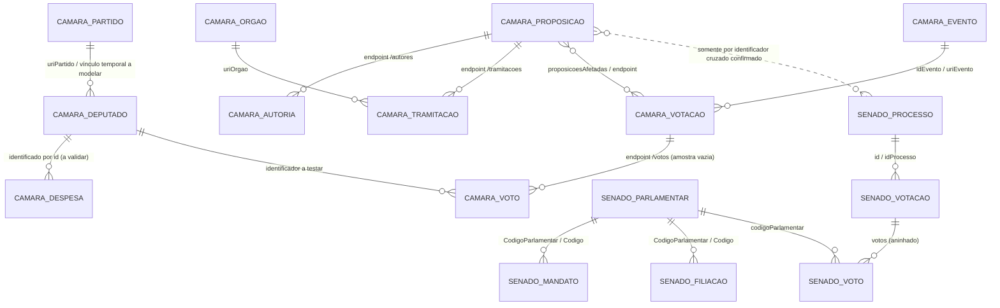

# Chaves e relacionamentos — mapa exploratório

Levantamento dos outputs dos notebooks e consultas pequenas em 9 de outubro de 2026. O catálogo completo de rotas e links de arquivos está em [`catalogo_recursos.csv`](catalogo_recursos.csv), gerado por [`refresh_catalog.py`](../scripts/refresh_catalog.py). APIs descrevem serviços; arquivos do catálogo nem sempre correspondem a tabelas relacionais. Chaves abaixo são classificadas por evidência, não por nome do campo isoladamente.

## Convenção de confiança

- **Confirmada no contrato**: identificador está no caminho do endpoint de detalhe ou declarado diretamente pelo contrato da API.
- **Observada**: chave/relação apareceu em resposta real e foi seguida por consulta de detalhe ou endpoint relacionado.
- **Candidata**: campo plausível, ainda sem teste de unicidade/cobertura ou sem garantia explícita da fonte.
- **Em aberto**: evidência insuficiente; não usar em joins de produção.

## Câmara dos Deputados

| Entidade/recurso | PK candidata | Relações/FK candidatas | Evidência e ressalvas |
| --- | --- | --- | --- |
| Deputado | `id` (**confirmada no contrato**) | `uriPartido` → Partido; `idLegislatura` → Legislatura; `ultimoStatus.id` identifica o mesmo deputado | `GET /deputados/{id}` responde para o ID 204379 e repete `id` no objeto de status. Partido atual é atributo mutável; não usar `siglaPartido` sozinha como chave. |
| Proposição | `id` (**confirmada no contrato**) | `uriAutores` → Autores; `uriPropPrincipal`, `uriPropAnterior`, `uriPropPosterior` → Proposição; `uriOrgaoNumerador` → Órgão | Detalhe de `117992` respondeu. Listagem expõe `id`, `siglaTipo`, `numero`, `ano`; número+ano+tipo não substitui o ID sem prova de unicidade. |
| Autoria de proposição | Chave composta provisória (`proposicao_id`, identidade do autor, `ordemAssinatura`) (**candidata**) | `proposicao_id` → Proposição; campo `uri` do autor aponta para a entidade autora | `/proposicoes/117992/autores` retornou 1 linha com `uri`, `nome`, `codTipo`, `tipo`, `ordemAssinatura` e `proponente`. A chave da entidade autora e unicidade da relação ainda precisam ser verificadas. |
| Tramitação | Chave composta provisória (`proposicao_id`, `sequencia`) (**candidata**) | `proposicao_id` → Proposição; `uriOrgao` → Órgão; `uriUltimoRelator` → Deputado | `/proposicoes/117992/tramitacoes` retornou 17 linhas com `sequencia`, órgão e relator. Confirmar unicidade de sequência dentro da proposição e cardinalidade histórica. |
| Votação | `id` texto (**confirmada no contrato como identificador de rota; unicidade ainda candidata**) | `idOrgao`/`uriOrgao` → Órgão; `idEvento`/`uriEvento` → Evento; `proposicoesAfetadas` → Proposição | A listagem trouxe IDs como `2611313-34`. Detalhe resolveu esse ID e trouxe `proposicoesAfetadas`. A lista de votos retornou vazia para esse exemplo; não generalizar ausência de voto nominal. |
| Despesa da cota | Sem PK natural identificada (**em aberto**) | `deputado_id` → Deputado; fornecedor por CPF/CNPJ; tipo de despesa por código/referência | Sem data, e também com `ano=2026&mes=8`, quatro deputados amostrados retornaram zero itens. Precisamos comparar outros meses/anos e o arquivo anual de cotas; não interpretar os zeros como cobertura completa. |

**Consultas de relação executadas:** proposição `117992` → autores (1) e tramitações (17), ambas HTTP 200; votações da proposição (0). Votação `2611313-34` → detalhe HTTP 200, mas `/votos` retornou 0.

## Senado Federal

| Entidade/recurso | PK candidata | Relações/FK candidatas | Evidência e ressalvas |
| --- | --- | --- | --- |
| Parlamentar | `CodigoParlamentar` (**observada**) | código em Mandato/Filiação → Parlamentar | Lista atual respondeu com 81 parlamentares; `CodigoParlamentar` é texto no feed e foi reutilizado para consultar detalhe `5672`. Preservar o tipo/texto bruto antes de normalizar. |
| Mandato | `CodigoMandato` (**candidata**) | `Parlamentar.Codigo`/`CodigoParlamentar` → Parlamentar; exercício/legislatura como filho temporal | Lista atual contém `Mandato.CodigoMandato`; endpoint de mandatos para senador 5672 respondeu e trouxe `Parlamentar.Codigo` e uma lista `Mandatos.Mandato`. Unicidade precisa ser testada no conjunto histórico. |
| Filiação partidária | Identificador próprio a descobrir; chave composta temporal (**em aberto**) | `Parlamentar.Codigo` → Parlamentar; partido e intervalo de vigência | Endpoint do senador 5672 respondeu com quatro filiações. Os campos exatos do item e a chave precisam ser inspecionados antes de modelar. |
| Processo legislativo | `id` (**confirmada no contrato de detalhe; candidata a PK global**) | `idProcesso` em Votação → `processo.id` (**observada/confirmada em detalhe**); possíveis vínculos externos por `identificacaoExterna`, `idProcessoCasaInicial` | `GET /processo/{id}` resolveu `1326805` e `2904181`. A votação filtrada trouxe `idProcesso=8361684` e o detalhe desse processo retornou o mesmo `id` e `codigoMateria=155773`. Lista ampla devolve `id` e `codigoMateria` distintos; `codigoMateria` não deve ser usado como PK sem comprovar escopo/unicidade. |
| Votação nominal | Chave composta ainda **em aberto**; testar `codigoSessao` + `codigoSessaoVotacao` e variantes SVE | `idProcesso` → Processo (**observada**); `codigoMateria` pode apontar a identificador legado de matéria; voto filho contém `codigoParlamentar` → Parlamentar (**observada**) | Período 2023-02 + parlamentar 5672 retornou 1 votação, com `codigoSessao=320695`, `codigoSessaoVotacao=6674`, `idProcesso=8361684`; seu voto aninhado contém `codigoParlamentar=5672`. Ainda não prova unicidade do par sessão/votação. |

**Consultas de relação executadas:** detalhe, mandatos e filiações do senador `5672` responderam HTTP 200. Processo `1326805` respondeu por ID. A consulta ampla de votações nominais por parlamentar retornou 423 linhas (resposta de cerca de 918 KB); ao filtrar para 2023-02, retornou uma votação pequena e permitiu confirmar a relação `idProcesso`→`processo.id` e o vínculo do voto aninhado com o parlamentar. A listagem irrestrita de processos respondeu cerca de 8,6 MB e não deve ser repetida para exploração rotineira.

## Junções entre Casas

Não há join entre Deputado e Senador: são entidades e namespaces distintos. Também não se deve unir proposição da Câmara a processo do Senado por ementa, número ou ano isolados. Campos do Senado como `identificacaoExterna`, `idProcessoCasaInicial`, `identificacaoProcessoInicial` e `siglaCasaIniciadora` são candidatos a vínculo explícito; ainda é necessário observar exemplos de matéria que efetivamente transitou entre Casas e comparar com `uriPropPrincipal`/relações da Câmara.

## Diagrama ER preliminar

## Próximas verificações de chaves

1. Calcular duplicatas/nulos nos identificadores de amostras paginadas e arquivos de referência sem assumir unicidade global.
2. Inspecionar respostas e subcampos da autoria, filiação, voto e mandato; validar cardinalidade e FKs por busca de detalhe.
3. Testar despesas de múltiplos períodos e comparar ao recurso anual de cotas.
4. Procurar proposições remetidas entre Casas e confirmar o vínculo via identificadores externos; manter sem join os casos sem chave explícita.
5. Marcar no catálogo data de consulta, status HTTP/URL e eventual depreciação; revisar antes de cada ingestão.
