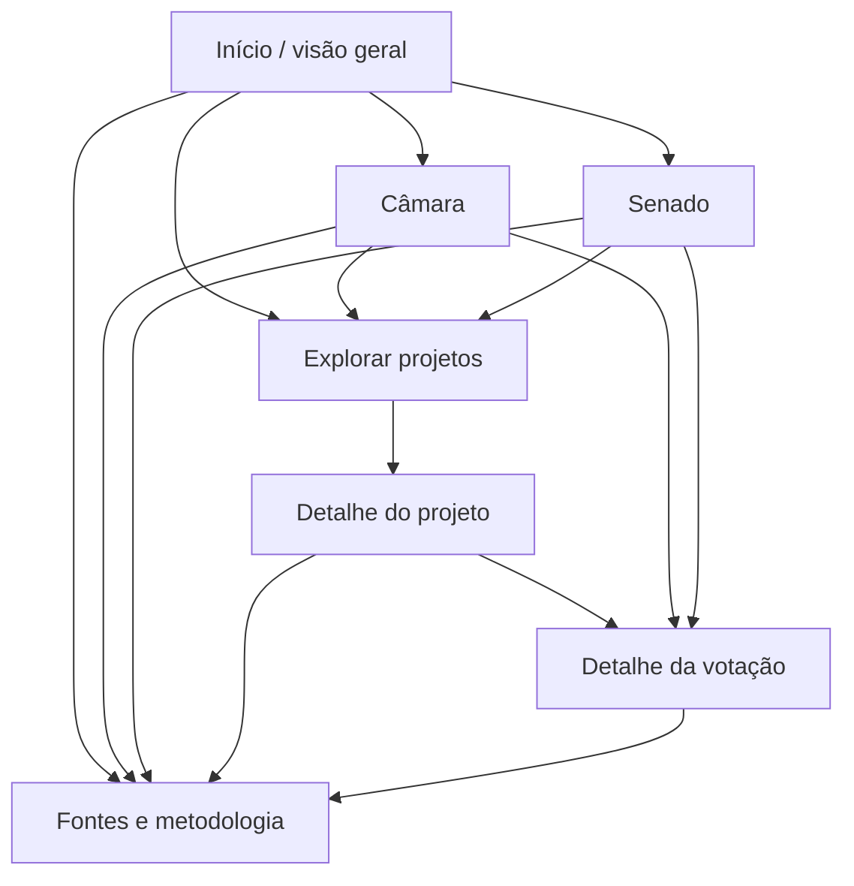

# Mapa de telas e prioridade dos visuais

Este documento registra a proposta funcional inicial. O primeiro site estático já foi implementado em `public/`: `/index.html`, `/casa.html?casa=camara|senado`, `/projetos.html`, `/projeto.html?casa=...&ano=...&tipo=...&id=...` e `/metodologia.html`. As rotas simples e as telas de votação da tabela abaixo continuam como proposta para uma etapa posterior. Os filtros da exploração ficam na URL; o ano representa a data de apresentação.

| Rota proposta | Pergunta que responde | Componentes e ação principal | Estados a desenhar |
| --- | --- | --- | --- |
| `/` | Como se distribui a atividade das duas Casas no período? | Seletor de período; cartões **separados** para Câmara/Senado; resumo das diferenças de mandato, tipos e votação; atalhos para cada Casa e projetos. | Cartão sem cobertura mostra `dados indisponíveis` e link para metodologia. |
| `/camara`, `/senado` | Quem compõe a Casa e quais iniciativas foram apresentadas? | Barras de composição por partido e UF; série mensal de PL/PLP/PEC; abas distintas de presença e votação quando viáveis; clique leva ao conjunto filtrado. | Presença do Senado aparece como `métrica em validação`; séries sem cobertura mostram lacuna, não zero. |
| `/projetos` | Quais projetos existem neste recorte e de que tratam? | Busca por número/ementa; filtros Casa, tipo, ano, situação, tema oficial e categoria do painel; tabela com fonte e situação; barras de temas com aviso de contagem multirrótulo. | Projeto sem tema oficial é encontrável por filtro `tema não informado`; busca vazia diferencia nenhum resultado de falha na consulta. |
| `/projetos/{casa}/{id}` | O que o projeto propõe e em que etapa está? | Cabeçalho com PL/PLP/PEC, ementa e link oficial; linha do tempo de tramitações; autoria; documentos; temas oficiais e enriquecidos; trecho/página de apoio; votações ligadas por ID explícito. | Documento inacessível ou texto não extraível mantém link oficial e estado específico. Rótulo pendente não aparece como fato. Votação não vinculada tem aviso de cobertura. |
| `/votacoes/{casa}/{id}` | O que foi votado e qual foi o resultado? | Resultado agregado e objeto votado; barras Plotly por código de voto, depois por partido se votos e filiação na data existirem; tabela individual; retorno ao projeto vinculado. | Votação não nominal ou sem votos individuais: manter resultado, esconder distribuição pessoal e explicar motivo. Código não decodificado aparece literalmente. |
| `/metodologia` | De onde vem cada número e o que ele permite concluir? | Dicionário de métricas, fontes, última coleta, período coberto, nulos, versões da taxonomia e revisão, limites conhecidos; links para APIs e documentos oficiais. | Pendências e mudanças de definição datadas e visíveis. |

## Ordem de entrega sugerida para a próxima etapa

1. **MVP implementado com dados observados:** composição atual por Casa, série de iniciativas PL/PLP/PEC, busca/detalhe de projetos e página de metodologia. Plotly: barras horizontais de partidos/UF, linha mensal por tipo e barras por tipo na visão geral. Temas oficiais não estão no JSON v1 e aguardam exportação. Todos os gráficos trazem período, Casa, fonte e unidade na área próxima ao visual e têm tabela textual equivalente.
2. **Após validar vínculos e códigos:** detalhe de votações, série de votações aprovadas, votos por código/partido e participação em votações nominais. `Aprovada em votação` fica claramente separado de tramitação final e norma publicada.
3. **Após validar denominadores e fontes:** taxa de presença por Casa, etapas de conclusão/aprovação, ideologia partidária. Senado fica sem taxa de presença até fonte equivalente comprovada.
4. **Após avaliação e revisão de rótulos:** categoria comum, subtema e direção de medida com evidência, versão e responsável. Filtros enriquecidos indicam sua origem e data.

Convenções visuais: cores consistentes por Casa; partidos identificados também por texto, nunca só por cor; eixos com unidade e período; barras ordenáveis; legenda legível no celular; descrição textual e tabela acessível para cada gráfico. Comparações entre Casas usam escalas e definições declaradas, com separação visual quando as coberturas diferirem.
